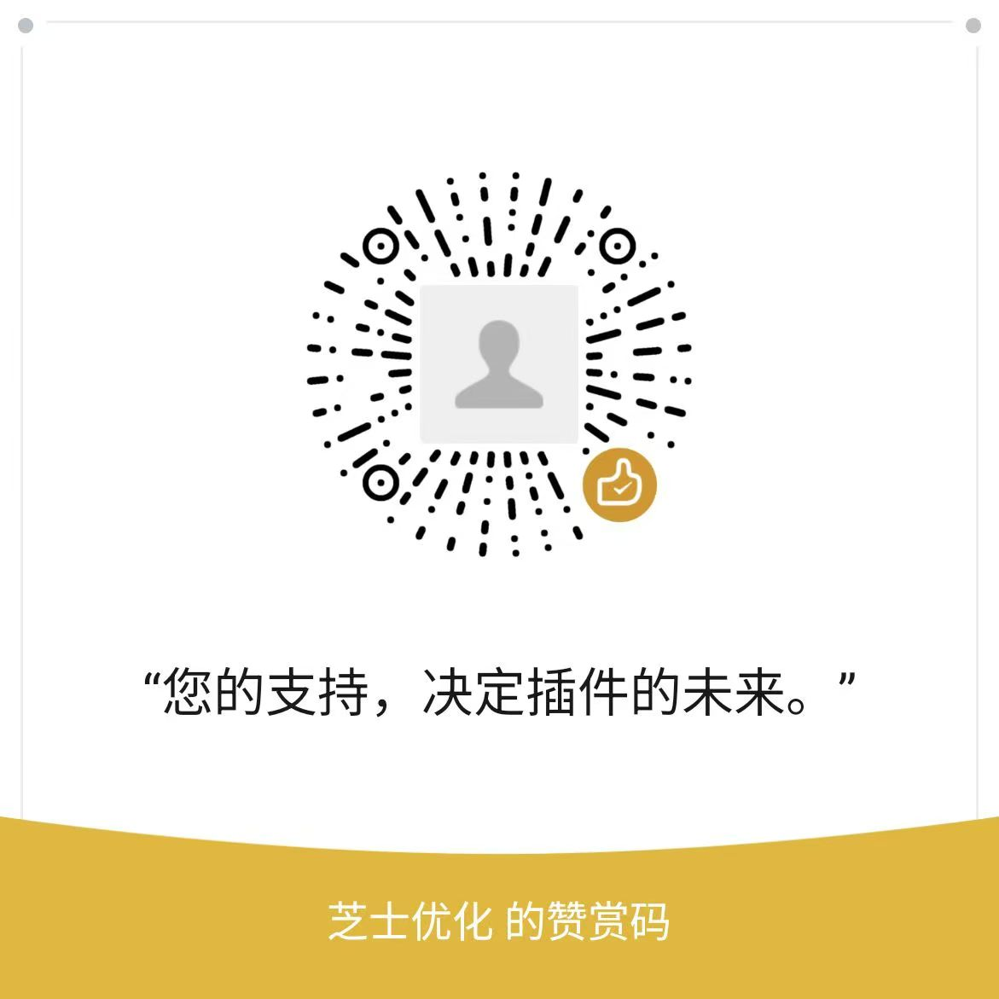

# WooLite v1.0.6 发布说明

## 版本信息
- **版本号**: v1.0.6
- **发布日期**: 2025-10-04
- **文件名**: woolite-chrome-extension-v1.0.6.zip

## 功能特性
- 轻量级设计：最小化依赖库，减少插件体积，提升运行性能
- 功能纯粹：只保留最实用的商品管理功能，避免功能冗余
- 完全免费：开源项目，无任何收费项目，社区驱动开发
- 简洁直观：简洁的用户界面，清晰明确的操作流程
- 多语言支持：支持中文、英文、繁体中文

## 核心功能
1. 店铺管理：支持添加、编辑、删除店铺（最多3个）
2. 商品管理：商品列表展示、搜索、筛选、批量操作
3. 简单商品编辑：功能强大的商品编辑界面
4. 订单提醒：轻量级订单通知功能
5. 多语言支持：中文、英文、繁体中文界面切换

## 安装指南

### 方法一：从ZIP文件安装（推荐）

1. 下载 `woolite-chrome-extension-v1.0.6.zip` 文件
2. 解压缩文件到您选择的目录
3. 打开 Chrome 或 Edge 浏览器
4. 进入 `chrome://extensions/`
5. 开启右上角的"开发者模式"
6. 点击"加载已解压的扩展程序"
7. 选择解压后的目录中的 `chrome-extension` 文件夹
8. 插件安装完成后，您会在浏览器工具栏看到 WooLite 图标

### 方法二：从源代码构建安装

1. 克隆项目到本地：`git clone [项目地址]`
2. 进入项目目录：`cd WooLite`
3. 安装依赖：`npm install`
4. 构建项目：`npm run build`
5. 准备多浏览器版本：`npm run build:multi`
6. 按照方法一的步骤 3-8 安装扩展

## 使用说明

1. 点击浏览器工具栏的 WooLite 图标打开插件
2. 首先添加您的 WooCommerce 店铺信息
3. 支持两种认证方式：
   - WooCommerce API：支持基本商品管理功能
   - WordPress 应用密码：支持完整的商品管理功能，包括图片上传
4. 添加店铺后即可开始管理您的商品

## 支持开发者

WooLite 是一个完全免费的开源项目。如果您觉得这个插件对您有帮助，欢迎通过扫描下方二维码进行打赏支持。您的支持将帮助我继续改进和维护这个项目。

感谢您的支持！